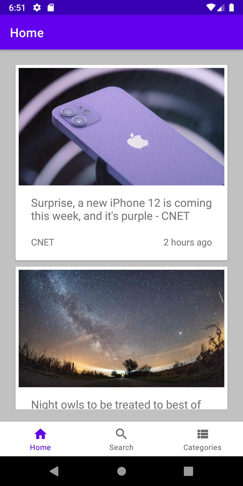
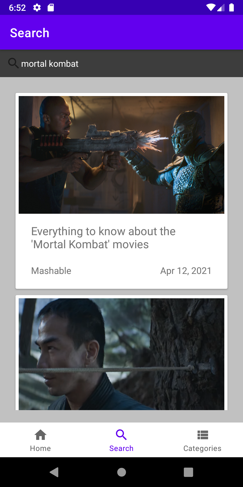
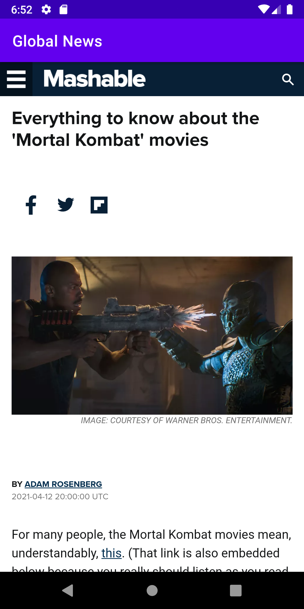
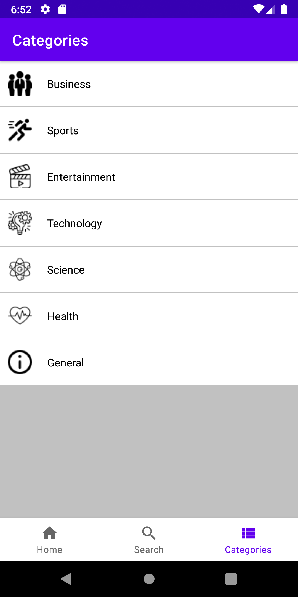

# Android Global News
## Prof. Deryk Kim, Advanced Android Development

## Overview
This application is a global news app using MVVM architecture. It retrieves news and blogs from NewsApi (https://newsapi.org)
and displays them in recycler views with the assistance of our helper libraries listed below.

## Libraries
Libraries used in this project include:  
**Retrofit:** API requests  
**ViewModel:** UI  
**Room:** Database  
**Glide:** Displaying images  
**LiveData / LifecycleScope:** Lifecycle  
**Moshi:** Parse JSON  

## Screenshots

  
  
  
  

## Pages

### Main page
Endpoint #1 top headlines. Card views in recycler view using title, title image,
published time, and possible save button.

### Search page
Endpoint #2 everything. Card views in a recycler view, using search keyword contained in title. Populate card views based on keyword existing in title.  

### Categories
Endpoint #3 sources. list view with different topics. Click topic and it searches articles related to that topic. ex. clicking sports will search for sports articles.  

### Saved articles page
Bookmark articles from anywhere to store in database viewing.  
TODO: viewpager2 for favourites list

### Setup Room Database
Configure local and domain layers
- add flag called headline
- delete unfaved data from dao
- unset headline flag when fetching new articles from saved articles

## Credits: Dave Nunez, Zhihong Cai, Rasheen Ruwisha
